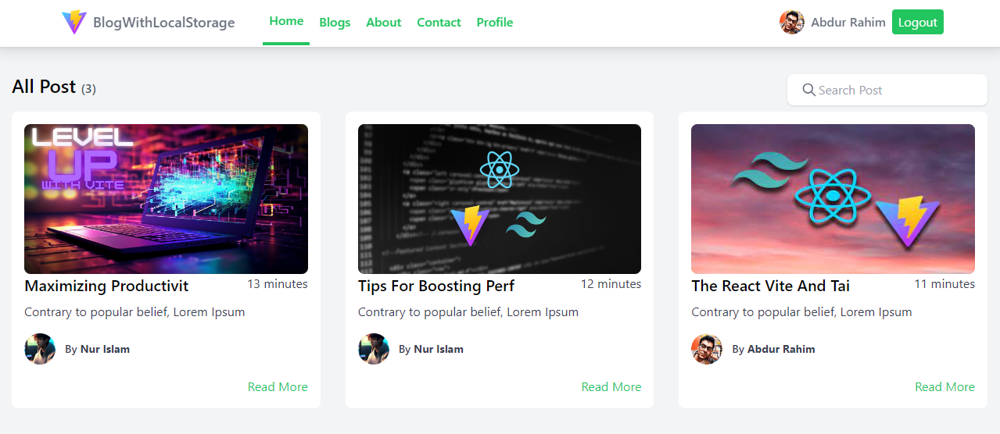
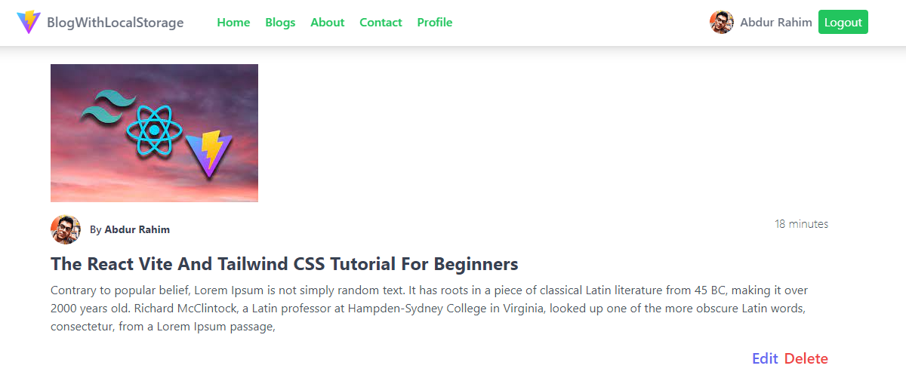

# React Vite Tailwind Project authentication and blog website with localStorage 
## Description 
This is a simple project with react vite tailwind css and localstorage. This project is a simple authentication and blog website. In this project you can create a blog and save it in localstorage. You can also delete the blog. You can also login and logout. This project is a simple project. I hope you like this project.

## Usage
1. Clone this repository
```bash
git clone https://github.com/AbdurRaahimm/react-blog-localstorage.git
```
2. Run The Essential Dependency
```bash
npm install
```
3. Run `npm run dev` to start the development server
```bash
npm run dev
```
4. Run `npm run build` to build the project
```bash
npm run build
```
5. Run `npm run serve` to serve the build
```bash
npm run serve
```

## Features
- Authentication
- Blog
- LocalStorage
- Login
- Logout
- Delete Blog
- Add/Edit Blog 
- Search post
- Edit profile
- Responsive Design (Mobile First) 


## Tools
- React
- Vite
- Tailwind CSS
- ESLint

## Screenshots




## Live Demo
[Live Demo](https://react-blog-localstorage.vercel.app/)


## Connect on Social Media
- [Twitter](https://twitter.com/AbdurRahim4G)
- [Instagram](https://www.instagram.com/abdurrahim4g/)
- [Facebook](https://www.facebook.com/Rahim72446)
- [LinkedIn](https://www.linkedin.com/in/abdur-rahim4g/)
- [YouTube](https://youtube.com/@AbdurRahimm)


